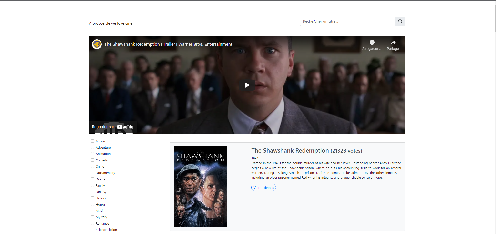
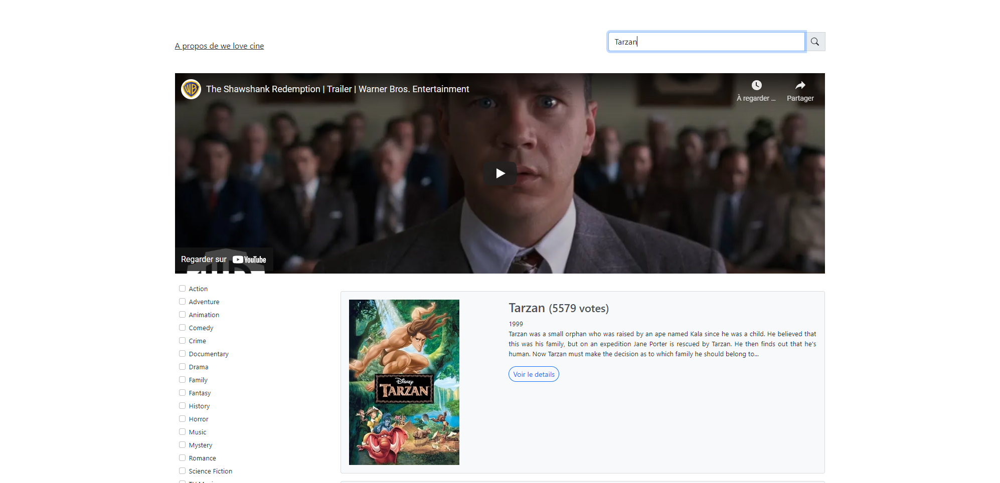
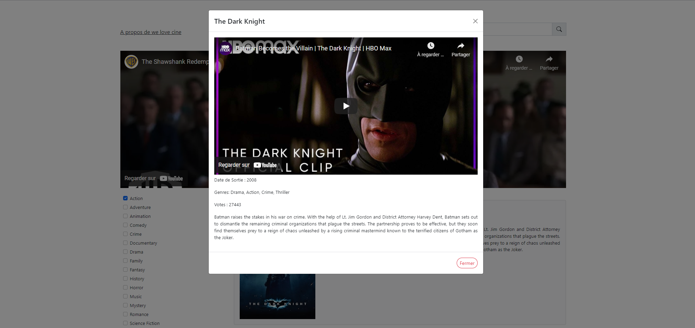

## We love cine 🎥! 

Cette mini appplication consiste à consommer une simple api videos!

### Prérequis


- [Docker CE](https://www.docker.com/community-edition)
- [Docker Compose](https://docs.docker.com/compose/install)
- [PHP 8+](https://docs.docker.com/compose/install)

### Installation

#### Cloner le repository git
```
$ git clone https://github.com/Solonirina/welovecine.git
```

#### Lancer les container

```
$ docker-compose up -d
```

#### Installations des dépendances

```
$ docker-compose exec php-fpm composer install
$ docker-compose exec php-fpm yarn encore dev 
```

### Lien du site
- [http://localhost:8080](http://localhost:8080)


### Test unitaire (En cours)

```
$ ./vendor/bin/simple-phpunit
```

### Captures d'écrans

- Accueil : Mise en avant de film le mieux notée + liste des tops film



- Recherche : Recherche un film par son titre

    ***PS : La recherche se lance uniquement en appuyant sur la touche entrée du clavier ou en cliquant sur la loupe***



- Détail : Popup pour la visualisation des détails du film


